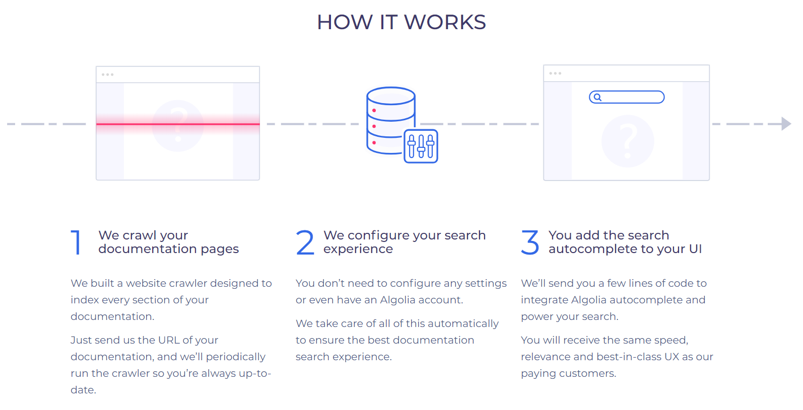
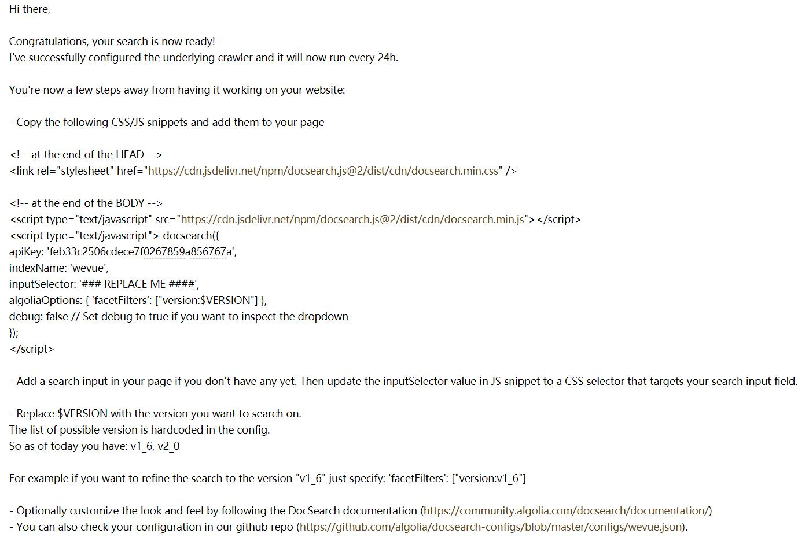
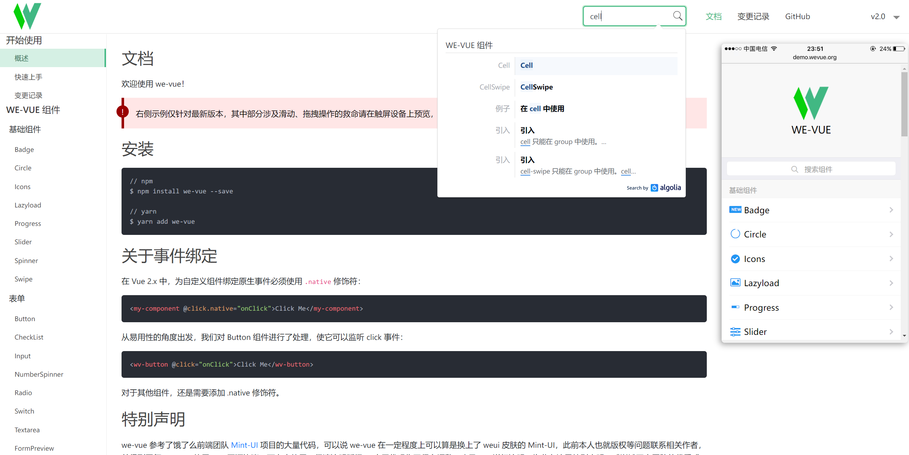

# 用 Algolia DocSearch 轻松实现文档全站搜索

话说，有两件事能让程序员抓狂，一是写文档，二是看别人的代码发现没写文档……

没错，咱程序员就是这么“双标”。 :smile:

不过麻烦归麻烦，出来混，文档还是要写的，不然哪天回头翻自己的项目，连自己都不知道写了个啥，就很尴尬了。当然，文档通常是为别人写的，特别是一些工具类的库或者开源软件，从最简单的 readme，到成体系的在线 wiki，再到自建在线文档网站，这大概是很多开源作者都有过的历程。

而对于在线文档网站，搜索功能能让查阅文档更加轻松，我也一直想着为自己的文档站搞个搜索功能，但看完一些全文搜索工具的教程后给整懵逼了，也迟迟没正式动手。直到最近发现了这货 —— [Algolia DocSearch](https://community.algolia.com/docsearch/)，前后不到 3 小时（包括申请时等待的时间）就弄好了。

了却心头大事后，也惊异于它好用，简直是难得的良心软件。如此幸事，岂能不装一逼？……

## Algolia DocSearch 的基本原理和主要优势

相对于其它一些全文搜索方案，Algolia DocSearch 的主要优势在于它是专门针对在线文档搜索这一需求的。不需要繁琐的配置，也不需要自己有数据库等软硬件支持，而只需在自己网站中插入少量代码就可以实现强大的文档搜索功能了。

根据官方的说明，在你通过申请后，其服务器会定期抓取（免费用户抓取周期是 24 小时）你的网站内容并分析，对文档的各级标题、段落等内容建立索引，这样，在网站中加入搜索框之后，用户输入关键时是便可以请求 DocSearch 的接口并显示搜索结果了。这些请求、结果显示相关的逻辑都封装好了，你要做的只是要按要求插入代码、样式以及那个搜索框。



## 实现步骤

1. 在 [Algolia DocSearch 官网](https://community.algolia.com/docsearch/) 填写自己的文档网站的地址和邮箱进行申请

DocSearch 可以免费使用，而且不用注册，因为他们觉得，任何人都应该能够有能力构建方便搜索的文档（可以说相当有情怀吧）。当然，也有收费的服务可供选用，差异在于技术支持和请求频率限制等方面不同。

2. 收到确认邮件并确认

提交申请之后不久，你所填写的邮箱就会收到一封询问邮件。里面说明你的网站技术上是否支持写用 DocSearch。如果支持，还会询问你是否能修改源码向其中注入需要的代码。你需要回复邮件进行确认。

3. DocSearch 对你的文档网站首次爬取页面数据，并向你发送需要注入的代码及相关操作指导。

第 2 和 第 3 步都需要对方人工处理，而且根据你的网站复杂程序，需要等待的时间会有差异，不过就我个人经验而言还是很快的。前后不到两个小时。

邮件内容大致如下：



4. 根据第 3 步里收到的邮件提示，修改网站代码

可以看到，邮件主要包括 apiKey 等配置信息，而且对于如何使用也描述得非常清楚了。系统甚至分析出我网站 url 中使用了 v1_6 和 v2_0 区分不同版本的文档，并为此提供相关的参数 `algoliaOptions: { 'facetFilters': ["version:$VERSION"] }, ` 以及详细使用例子说明，简直无微不至，催人尿下……

因为自己网站用 vue 单文件组件写的，所以我选择使用 npm 包，而并没有完全照着邮件里来，但这实质是一样的。

首先，安装 docsearch.js 包

```bash
yarn add -D docsearch.js
```

然后，修改文档页面组件，加入搜索输入框和 docsearch 初始化代码

```html
<template>
  <input
    v-show="$route.path.indexOf('/doc') === 0"
    type="text"
    class="search-input"
    id="search_input"
    placeholder="搜索文档"
  >
</template>

<script>
import 'docsearch.js/dist/cdn/docsearch.min.css'
import docsearch from 'docsearch.js'

export default {
  mounted () {
    docsearch({
      apiKey: 'feb33c2506cdece7f0267859a856767a',
      indexName: 'wevue',
      inputSelector: '#search_input',
      algoliaOptions: { 'facetFilters': ['version:v2_0'] },
      debug: false // Set debug to true if you want to inspect the dropdown
    })
  }
}
</script>
```

> **注意：上面只是最简单的示例。实际上使用可以更灵活，例如装搜索框封装成一个组件，若有兴趣，可前往 [we-vue](https://github.com/tianyong90/we-vue) 查看实际使用情况。**

最后根据自己的喜好及需要，调整下搜索框及搜索下拉弹出层的样式，就完工了。下面是最终效果。



## 总结

Algolia DocSearch 可以说真如其官网描述的那样，算是目前构建可在线搜索文档的最简单的方式之一了。你只需要关注文档本身，进行少量的配置，其它的 Algolia 全包了。另外，Algolia 还有一些其它优秀产品及服务，诸位可前往官网自行探索。

本文以自己的项目为例，但 Aloglia DocSearch 适合很多类型的网站，使用 [Vue.js 官网](https://vuejs.org)这类用 HEXO 构建的静态站，又或者像 [Easywechat](https://easywechat.com) 一样用 Laravel 开发的动态网站（事实上自己早前曾向超哥安利过 DocSearch, 然后竟然真被用上了 :smile: ）。有了搜索功能之后，用户能更方便有找到自己想要的信息，当然，网站的格调也极大的提升了！
